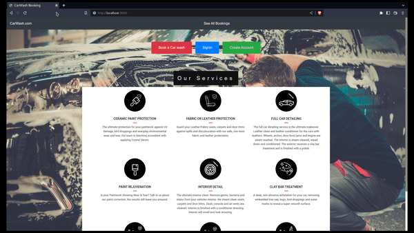

# Car-Wash-Booking web-app


### USER Features demo (GIF)



### Admin Features demo (GIF)


### Tech Stack Used

-   Backend : NodeJS,Express
-   Frontend : ReactJS
-   DB : MongoDB

### HOW TO RUN

> INSTALL DEPENDECIES

```sh
git clone https://github.com/glowfi/car-wash-booking
cd car-wash-booking

cd frontend
npm install
cd ..

cd backend
npm install
cd ..
```

> RUN Frontend

```sh
cd frontend
npm start
```

> RUN Backend

```sh
cd backend
npm start
```
